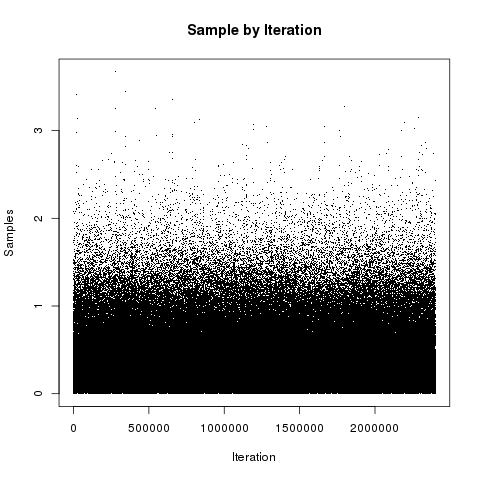
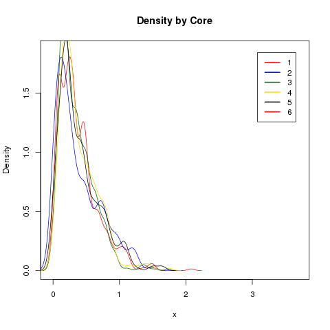
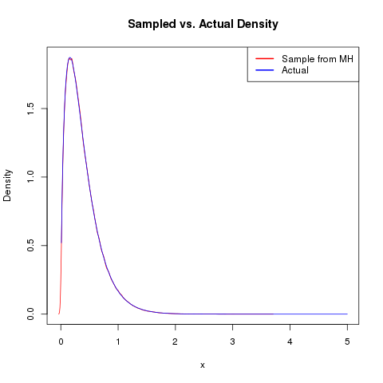
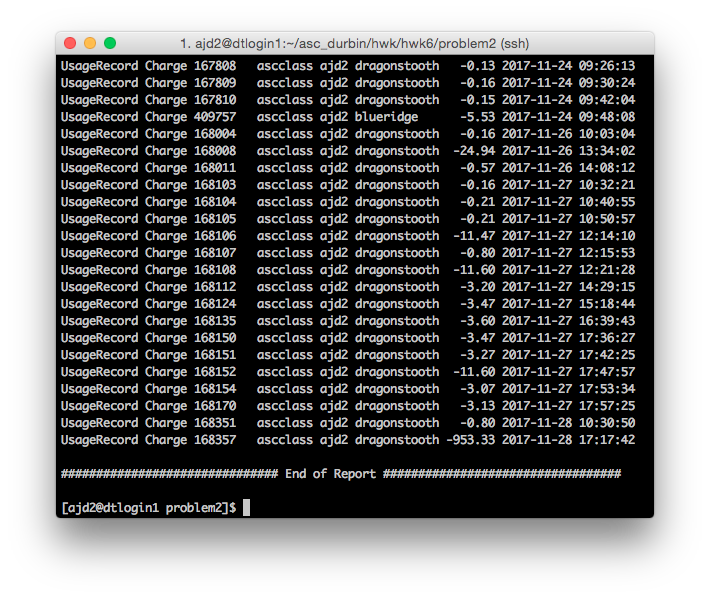
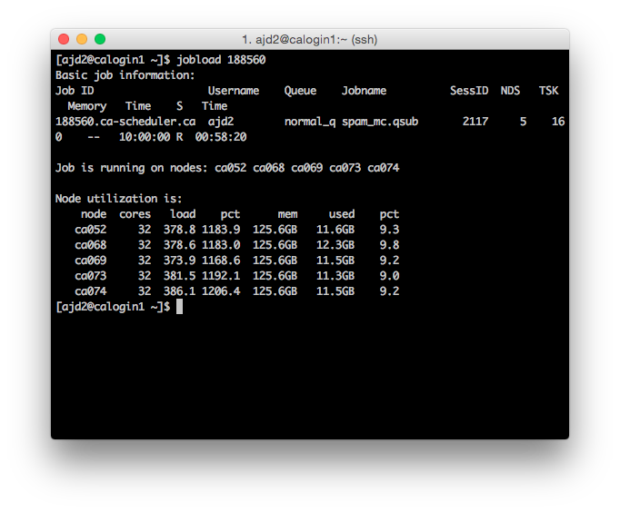
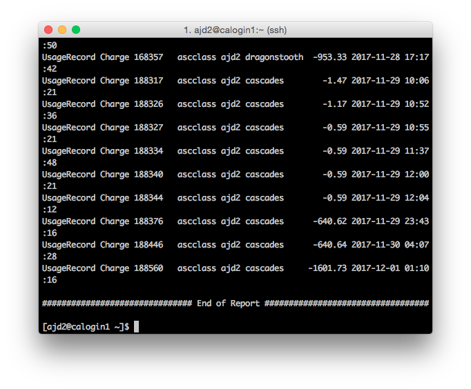

```{r setup, include=FALSE}
knitr::opts_chunk$set(echo = TRUE)
library(ggplot2)
```


# Problem 1

## MCPI

Our `qsub` script is as follows:

```{r eval=FALSE}

#!/bin/bash

# Sample submission script for snow Pi Monte Carlo
# Make sure to change the -A line to your allocation

#PBS -l walltime=00:10:00
#PBS -l nodes=2:ppn=24
#PBS -W group_list=dragonstooth
#PBS -q normal_q
#PBS -A ascclass

# Add modules
module purge
module load intel mkl R/3.4.1 openmpi hdf5/1.8.16 netcdf-c/4.4.0
module load R-parallel/3.4.1


# Change to the directory from which the job was submitted
cd $PBS_O_WORKDIR

# Run R
Rscript mcpi_snow.r

exit;

```

Our `qsub.o` output is as follows.

```{r eval=FALSE}

running parallel version with n.pts =  1e+06  and ncores =  48  ( 20834  pts     per core)
     48 slaves are spawned successfully. 0 failed.
  [1] "RNGstream"
  [1] 1
      pi estimate =  3.141928
   relative error =  0.0001067441
   computational time =  0.936867
           total time =  4.222405

```

## MH

Our `qsub` script is as follows.

```{r eval=FALSE}

 #!/bin/bash

 # Sample submission script for snow Metropolis-Hastings
 # Make sure to change the -A line to your allocation

 #PBS -l walltime=00:10:00
 #PBS -l nodes=2:ppn=24
 #PBS -W group_list=dragonstooth
 #PBS -q normal_q
 #PBS -A ascclass

 # Add modules
 module purge
 module load intel mkl R/3.4.1 openmpi hdf5/1.8.16 netcdf-c/4.4.0
 module load R-parallel/3.4.1


 # Change to the directory from which the job was submitted
 cd $PBS_O_WORKDIR

 # Run R
 Rscript mh_snow.r

 exit;

```

We get the following plots with our output.





# Problem 2

Our `qsub` script and `R` files are the same as given in class. We show the following `jobload` and `gstatement` figures.




We generate boxplots of the RMSPEs.

```{r}

load("prb2/sat_graceHe_laGP_cv.RData")
ggplot(stack(rmspe), aes(x = ind, y = values)) +
  geom_boxplot() +
  theme(axis.text.x = element_text(angle = 90, hjust = 1))

```

# Problem 3

## `GNU Parallel`

Our `qsub` script is as follows.

```{r eval=FALSE}

#!/bin/bash

#PBS -l nodes=5:ppn=32
#PBS -l walltime=10:00:00       
#PBS -q normal_q              
#PBS -W group_list=cascades   
#PBS -A ascclass

cd $PBS_O_WORKDIR

module purge
module load intel mkl R/3.4.1

export R_LIBS="$HOME/R/lib:$R_LIBS"

module load parallel
module save

cat $PBS_NODEFILE | uniq >> nodes

nth=5     #Number of total processes to run
nj=$PBS_NP  #Number of proccesses to run at a time
reps=6

export MKL_NUM_THREADS=32

echo "$( date ): Starting spam_mc"
seq 1 $nth | parallel --workdir . --sshloginfile nodes -j $nj \
"R CMD BATCH \"--args seed={} reps=$reps\" spam_mc.R spam_mc_{}.Rout"
echo "$( date ): Finished spam_mc"

echo "$( date ): Starting spam_mc_collect"
R CMD BATCH spam_mc_collect.R
echo "$( date ): Finished spam_mc_collect"


```

We have the following figures for `jobload` and `gstatement`.




And we can get boxplots of the hit rates using `spam_mc_collect.R`.

```{r}

setwd("./prb3/prta/")
source("spam_mc_collect.R")
setwd("../../")

```

## `MPI`

Our job submission was too far behind the queue and was blocked, so we have no boxplots to display. Our `qsub` script is as follows.

```{r eval=FALSE}

#!/bin/bash
#PBS -l walltime=12:00:00
#PBS -q normal_q
#PBS -A ascclass
#PBS -W group_list=dragonstooth
#PBS -l nodes=5:ppn=24

## interactive version for testing
## interact -lnodes=5:ppn=24 -lwalltime=1:00:00 -A ascclass -qnormal_q

## Add modules
module purge
module load intel mkl R/3.4.1 openmpi hdf5/1.8.16 netcdf-c/4.4.0 R-parallel/3.4.1
module save

## Change to the directory from which the job was submitted
cd $PBS_O_WORKDIR

## Run R
Rscript spam_snow.R

## Solution to the MPI busy-wait problem
while [ 1 ]; do
    sleep 1
    PID=$(pgrep -f "R --slave --no-restore --file=$SCRIPT")
    [ -z "$PID" ] || break
done

renice 19 $PID

wait

exit;

```

We modified the relevant parts of `spam_snow.R` as follows.

```{r eval=FALSE}

library(Rmpi, lib.loc = "~/R/lib")
library(parallel, lib.loc = "~/R/lib")
np <- as.numeric(Sys.getenv("PBS_NUM_NODES"))
cl <- makeCluster(np, type = "MPI")
nth <- as.numeric(Sys.getenv("PBS_NUM_PPN")
hitrate <- spamcv.snow(cl, spam)
stopCluster(cl)
mpi.exit()

save.image("spam_snow.RData")

```