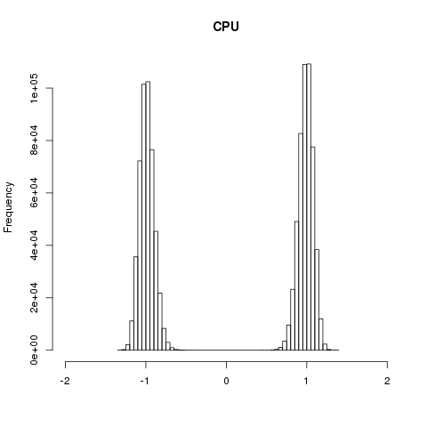
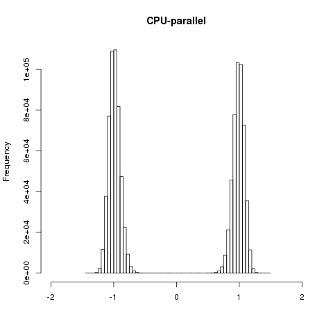
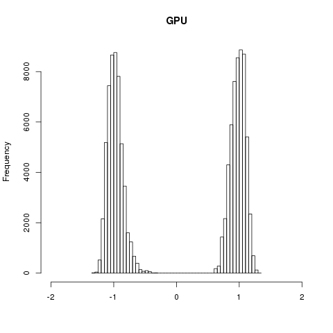

```{r setup, include=FALSE, warning=FALSE}

knitr::opts_chunk$set(echo = TRUE)
library(quantmod)
library(plotly)
library(ggplot2)
options("getSymbols.warning4.0"=FALSE)
options("getSymbols.yahoo.warning"=FALSE)

```

# `ggplot2/plotly` Problem 1

## Part A

We make our plots and fit the regression lines for each league as across differnet variables as follows.

```{r}

baseball <- read.csv("plotly/baseball.csv")

ggplot(data = baseball, mapping = aes(x = o_Eye, y = Winning_Percentage,
                                      color = League)) +
    geom_point() +
    geom_smooth(method = "lm", se = FALSE) +
    ggtitle("Winning Percentage Versus Walks/Hit-By-Pitch Percentage By League") +
    xlab("Walks/Hit-By-Pitch Percentage") +
    ylab("Winning Percentage")

```

We see that Walks/Hit-By-Pitch Percentage is more strongly correlated with Winning Percentage in the MLB than the Minors. Additionally, The majority of Minor League teams have higher Walks/Hit-By-Pitch rates than MLB teams. 

```{r}

ggplot(data = baseball, mapping = aes(x = o_Average, y = Winning_Percentage,
                                      color = League)) +
    geom_point() +
    geom_smooth(method = "lm", se = FALSE) +
    ggtitle("Winning Percentage Versus Average Hit Percentage By League") +
    xlab("Average Hit Percentage") +
    ylab("Winning Percentage")

```

We see that Average Hit and Winning percentages are more strongly associated with Minor League teams than with Major League teams here. Furthermore, several Minor League teams have higher average hit percentages than Major League teams.

```{r}

ggplot(data = baseball, mapping = aes(x = o_Power, y = Winning_Percentage,
                                      color = League)) +
    geom_point() +
    geom_smooth(method = "lm", se = FALSE) +
    ggtitle("Winning Percentage Versus Average Number Of Bases Per Hit By League") +
    xlab("Average Number Of Bases Per Hit") +
    ylab("Winning Percentage")

```

We see similar strengths of association between Average Number Of Bases Per Hit and Winning Percentage between each league, with slightly stronger association for Major League teams. We also see that Major League teams have an overall higher Average Number Of Bases Per Hit than Minor League teams.

## Part B

We make boxplots with five number summaries using the following code.

```{r}

ggplot(data = baseball, mapping = aes(x = League, y = o_Average)) +
    geom_boxplot() +
    ylab("Average Hit Percentage") +
    ggtitle("Distribution Of Average Hit Percentage By League") +
    geom_text(data = baseball %>% 
                         group_by(League) %>% 
                         summarise(five = list(fivenum(o_Average))) %>% 
                         tidyr::unnest(), 
               aes(x = factor(League), y = five, label = five), 
               nudge_x = 0.5)

```

Surprisingly, we see that Minor League teams have higher median, mean, and quartile Average Hit percentages than Major League teams. The Minor League distribution does have more variability than Major League teams. The distributions do appear significantly different. 

# `ggplot2/plotly` Problem 2

Our interactive graphic is created as follows.

```{r, warning=FALSE}

rm(list = ls())

df <- getSymbols(Symbols = "AAPL", src = "yahoo")
df <- data.frame(Date = index(AAPL), coredata(AAPL))
df <- subset(df, Date >= "2017-01-01")
names(df) <- sub("^AAPL\\.", "", names(df))

# labels for increasing/decreasing
for (i in 1:nrow(df)) {
    if (df$Close[i] >= df$Open[i]) {
        df$direction[i] = "Increasing"
    } else {
        df$direction[i] = "Decreasing"
    }
}

# mark iphone x release date
a <- list(text = "Oct. 27\niPhone X\nReleased",
          x = '2017-10-27',
          y = 1.05,
          xref = "x",
          yref = "paper",
          xanchor = "left",
          showarrow = FALSE)

# use shapes to create a line
l <- list(type = line,
          x0 = "2017-10-27",
          x1 = "2017-10-27",
          y0 = 0.5,
          y1 = 1,
          xref = "x",
          yref = "paper",
          line = list(color = "black", width = 0.5))

# top plot
p <- plot_ly(df,
             type = "candlestick",
             x = ~Date,
             open = ~Open,
             close = ~Close,
             high = ~High,
             low = ~Low,
             increasing = list(line = list(color = "red")),
             decreasing = list(line = list(color = "forestgreen"))) %>% 
    layout(showlegend = FALSE,
           annotations = a,
           shapes = l,
           axis = list(rangeslider = list(visible = FALSE)),
           yaxis = list(title = "Price"))

# bottom plot
pp <- plot_ly(df,
              x = ~Date,
              y = ~Volume,
              type = "bar",
              name = "Volume",
              color = ~direction,
              colors = c("forestgreen", "red")) %>% 
    layout(yaxis = list(title = "Volume"))

# combine into subplot
subplot(p,
        pp,
        heights = c(0.7, 0.2),
        nrows = 2,
        shareX = TRUE,
        titleY = TRUE) %>% 
    layout(title = paste0("Apple: 2017-01-01 - ", Sys.Date()),
           showlegend = FALSE,
           xaxis = list(rangeslider = list(visible = FALSE)),
           showlegend = FALSE)

```

# GPU Problem 1

We get the following plots for the different runs using `MetroH_PT.R`.

```{r, echo=FALSE}





```

We see that we get near identical resuls for all three computation methods.

```{r, echo=FALSE}

cpu <- c(12.010, 193.7, 0, 17, 0)
cpu_parallel <- c(0.767, 0, 0, 17, 0)
gpu <- c(1.048, 155.1, 0, 308, 98) 
results = data.frame(cpu = cpu, cpu_parallel = cpu_parallel, gpu = gpu,
                     row.names = c("Elapsed Time", "Peak CPU %", "Peak CPU Memory %",
                                   "Peak GPU Memory MB", "Peak GPU Utilization %"))
knitr::kable(results)

```

We see that the parallel CPU runs are slightly faster than the GPU runs. We can attribute this to memory allocation and copying to and from the CPU cache to the GPU cache. We also note that for both CPU runs that the GPU uses 17 MB of memory on idle. The GPU runs only used a single GPU also. The parallel CPU version was so fast that `top` could not pick up any measurement on utilization or memory usage, so we do not have any useful metrics to report other than the runtime. 
